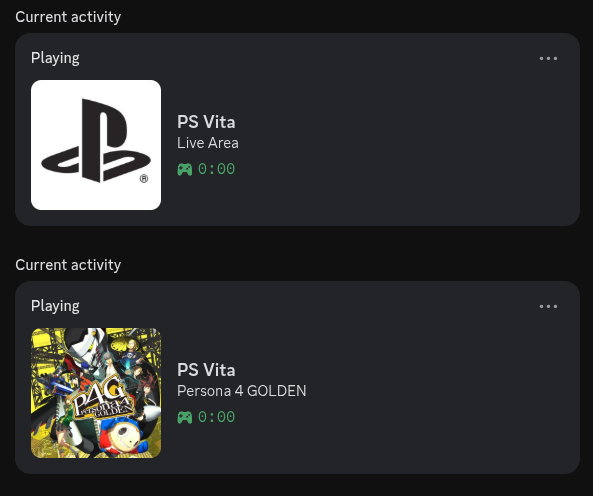

# vita-presence-rs




This is a client for the [VitaPresence](https://github.com/Electry/VitaPresence) PS Vita kernel plugin, based on [vita-presence-the-server](https://github.com/TheMightyV/vita-presence-the-server)

It adds automatic images for official Vita, PSP, and PS1 games rather than uploading manually like on vita-presence-the-server.

## Download
- [Latest Release](https://github.com/krypt0graphy/vita-presence-rs/releases/latest)
- [Crates.io](https://crates.io/crates/vita-presence-rs) 
```bash
cargo install vita-presence-rs
```
- [AUR](https://aur.archlinux.org/packages/vita-presence-rs)
```bash
yay -S vita-presence-rs
```
- [AUR Prebuilt](https://aur.archlinux.org/packages/vita-presence-rs-bin)
```bash
yay -S vita-presence-rs-bin
```

## Instructions
1. Install [the kernel plugin](https://github.com/Electry/VitaPresence) on your Vita

2. Create an application on the [Discord Developer Portal](https://discord.com/developers/home) name it something like PS Vita, this will show on your profile as "**Playing *PS Vita*** and copy the Application ID

3. Configure the app — run it once to generate an example config at:
   - **Linux:** `~/.config/vita-presence-rs/config.json`
   - **Mac:** `~/Library/Application Support/vita-presence-rs/config.json`
   - **Windows:** `%APPDATA%\vita-presence-rs\config.json`

```json
{
    "ip": "YOUR_VITA_IP",
    "client_id": "YOUR_DISCORD_APP_ID",
    "default_image": "https://gmedia.playstation.com/is/image/SIEPDC/ps-logo-favicon?$icon-196-196--t$",
    "show_live_area": false,
    "refresh_interval": 5
}
```

| Field | Description |
|-------|-------------|
| `ip` | Your Vita's local IP address |
| `client_id` | Your Discord application ID |
| `default_image` | Image URL shown when no game image is found, system and homebrew apps and the live area if that is enabled |
| `show_live_area` | Show presence when on the Vita home screen |
| `refresh_interval` | How often to poll the Vita in seconds |

4. Run it

## Building

### Requirements
- [Rust](https://rustup.rs)

```bash
git clone https://github.com/krypt0graphy/vita-presence-rs.git
cd vita-presence-rs
cargo build --release
```

Binary will be at `target/release/vita-presence-rs` (or `vita-presence-rs.exe` on Windows).

## Credits
- [Electry](https://github.com/Electry) for VitaPresence
- [TheMightyV](https://github.com/TheMightyV) for vita-presence-the-server
- [Andiweli](https://github.com/Andiweli) for the HexFlow covers repository
